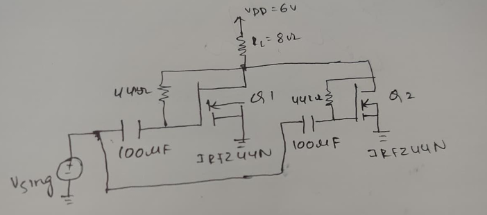
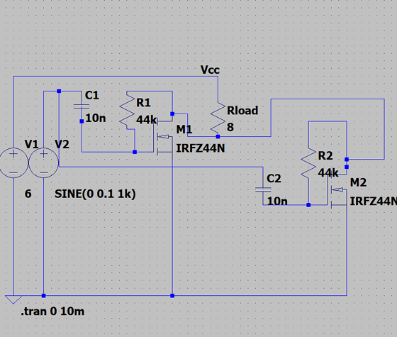
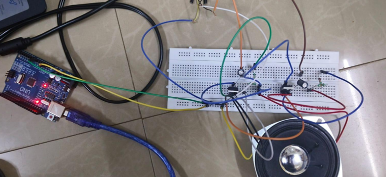
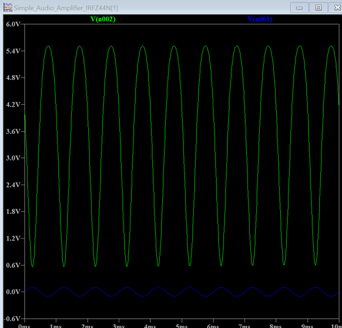

# 🔊 Two-Stage MOSFET Audio Power Amplifier Using IRFZ44N

## 📌 Overview

This project focuses on the design, simulation, and hardware implementation
of a two-stage MOSFET audio amplifier using IRFZ44N transistors.

The system is designed to amplify a low-level audio signal and drive a
4 Ω speaker. The project combines circuit design, MOSFET-based signal
amplification, LTspice simulation, breadboard implementation, waveform
analysis, and practical output measurements.

## 🎯 Objectives

- Design a two-stage audio amplifier using IRFZ44N MOSFETs
- Amplify a low-level AC/audio input signal
- Drive a 4 Ω speaker with the amplified output
- Analyse the operation of MOSFET-based amplification stages
- Simulate the amplifier circuit using LTspice
- Implement the circuit practically on a breadboard
- Compare simulated waveforms with practical observations
- Measure and analyse input and output voltage levels

## 🧩 Components Used
```
| Component        | Specification |    Quantity |
| ---------------- | ------------- | ----------: |
| Resistor         | 22 kΩ         |           4 |
| Capacitor        | 100 µF        |           2 |
| MOSFET           | IRFZ44N       |           2 |
| Breadboard       | —             |           1 |
| Connecting Wires | —             | As required |
| Power Supply     | 3.3 V / 5 V   |           1 |
| Speaker          | 4 Ω / 30 W    |           1 |
| Audio Jack       | —             |           1 |

```

## ⚙️ Working Principle

The amplifier uses two IRFZ44N MOSFETs as the main amplifying devices.

The input audio signal is passed through a coupling capacitor so that the
AC component reaches the amplifier while DC is blocked.

The two MOSFET stages process alternate portions of the input waveform.
The first transistor handles the positive half-cycle, while the second
transistor handles the negative half-cycle. The two amplified portions
combine at the output to reproduce the amplified waveform.

The output is AC-coupled to the speaker through a capacitor, which blocks
DC and allows the amplified audio signal to reach the 4 Ω speaker.

## Signal Flow

```text
Audio Input
     ↓
Input Coupling Capacitor
     ↓
MOSFET Amplification – Stage 1
     ↓
Interstage Coupling
     ↓
MOSFET Amplification – Stage 2
     ↓
Output Coupling Capacitor
     ↓
4 Ω Speaker
```
## 🔌 Circuit Diagram



## 💻 LTspice Simulation



The two-stage amplifier circuit was simulated using LTspice to analyse
the circuit behaviour and observe the input and output waveforms.

## 🔧 Hardware Implementation



The amplifier was assembled on a breadboard and tested using an audio
signal from a mobile phone or laptop.

The output was connected to a 4 Ω speaker to evaluate the practical
operation of the amplifier.

## 📈 Output Waveform



The simulated waveform shows the input and output signals of the
two-stage amplifier.


## 📊 Measured Results
```
| Parameter      |       Measured Value |
| -------------- | -------------------: |
| Input Voltage  | 0.188 V peak-to-peak |
| Output Voltage | 4.948 V peak-to-peak |
| Speaker Load   |                  4 Ω |
```
The practical test produced a noticeably louder audio output through the
4 Ω speaker. The sound was clear at moderate input levels, while slight
distortion was observed when the input level was increased significantly.

## 🔍 Observations

The IRFZ44N MOSFETs acted as the primary amplifying devices.
Increasing the input volume increased the speaker output.
The amplifier produced a measurable increase in output amplitude.
The output was clear at moderate input levels.
Slight distortion appeared at higher input levels.
The circuit successfully drove the connected 4 Ω speaker.

## 🏁 Result

The two-stage MOSFET audio amplifier was successfully designed,
simulated, and implemented on a breadboard.

The practical test demonstrated that a low-level audio signal from a
mobile phone or laptop could be amplified and reproduced through a
4 Ω speaker.

## 📁 Repository Structure
```
two-stage-mosfet-audio-amplifier-irfz44n/
│
├── images/
│   ├── breadboard-implementation.png
│   ├── circuit-diagram.png
│   ├── ltspice-simulation.png
│   └── output-waveform.png
│
├── report/
│   └── project-report.pdf
│
└── README.md
```
## 📄 Project Report

[View Complete Project Report](report/project-report.pdf)

## 🛠️ Tools & Technologies
```
- LTspice
- Analog Electronics
- MOSFET-Based Amplification
- Breadboard Prototyping
- Audio Signal Analysis
- Practical Circuit Testing
```
